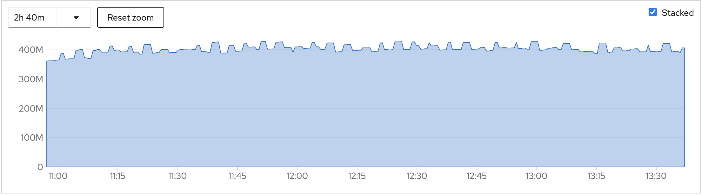
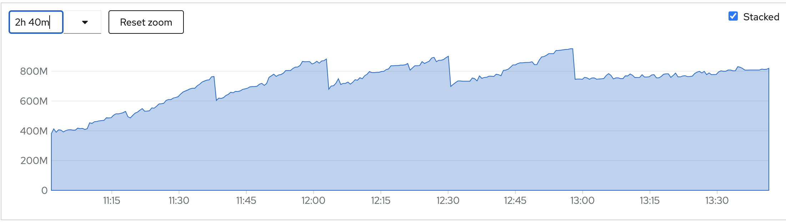
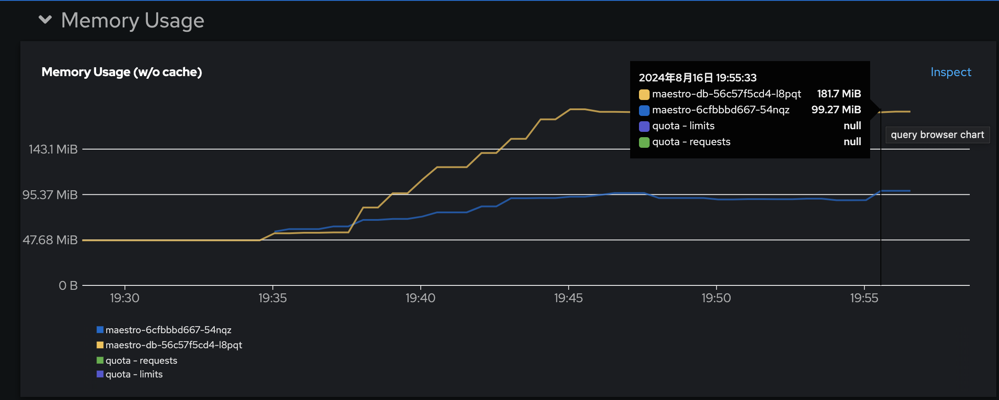
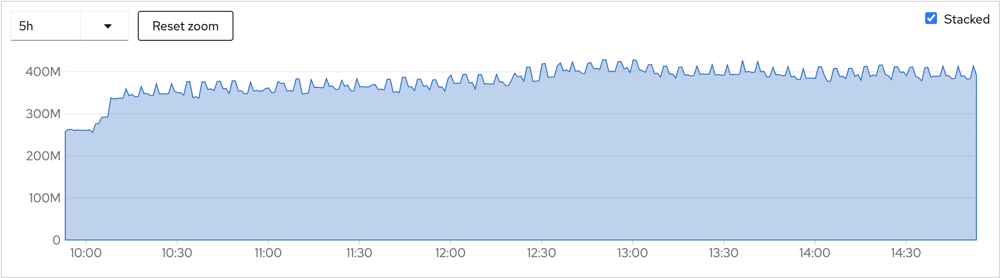
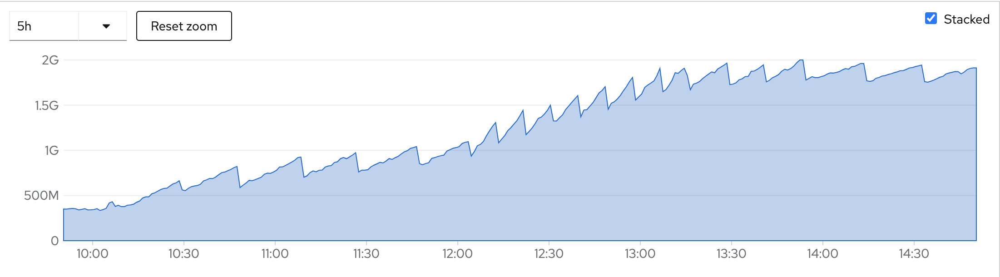
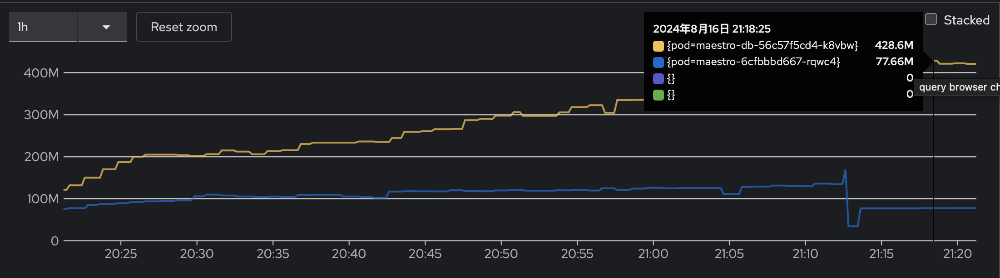
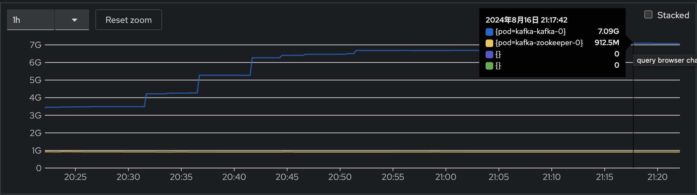

### Workloads

Using below works as workload (totol size is 666K, each work has spec and status)

```
kubectl -n local-cluster get manifestworks
NAME                                         AGE
addon-application-manager-deploy-0           45h
addon-cert-policy-controller-deploy-0        45h
addon-cluster-proxy-deploy-0                 45h
addon-config-policy-controller-deploy-0      45h
addon-governance-policy-framework-deploy-0   45h
addon-hypershift-addon-deploy-0              45h
addon-iam-policy-controller-deploy-0         45h
addon-managed-serviceaccount-deploy-0        45h
addon-work-manager-deploy-0                  45h
local-cluster-klusterlet                     45h
local-cluster-klusterlet-crds                45h
```

### clusters=1000, works=11k (11 works/cluster)

#### KubeAPIServer


#### ETCD


#### Maestro


#### Kafka


### clusters=1000, works=55k (55 works/cluster)

#### KubeAPIServer


#### ETCD


#### Maestro


#### Kafka


### clusters=5000, works=55k (11 works/cluster)

In this senerio, there are 5000 clusters in maestro and 20000 topics, 20000 acls in Kafka (each cluster need 4 topics and 4 acls)

The problem: if there are a lot of topics and acls in Kafka, when Kafka start reblance, it will cause `All broker connections are dow` easily, we may need consider to eliminate the numbers of topics.

### clusters=9000, works=99K (11 works/cluster)
N/A

## Global Hub (TODO)
