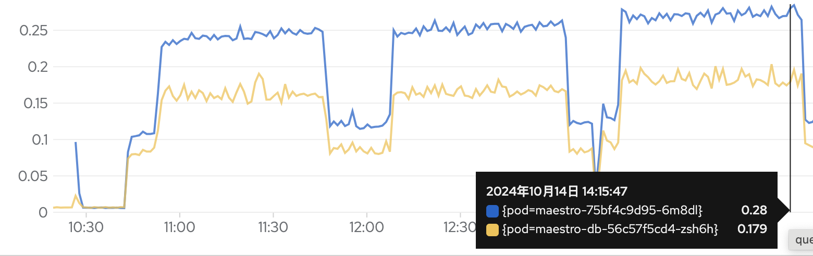
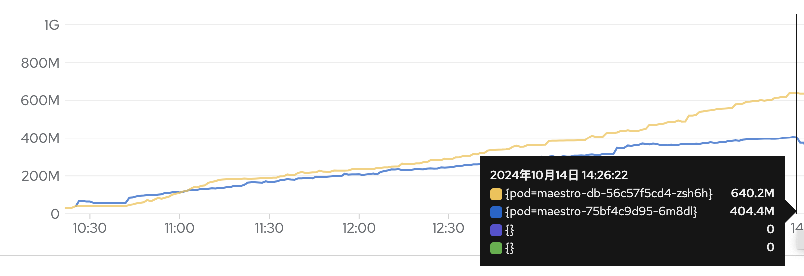
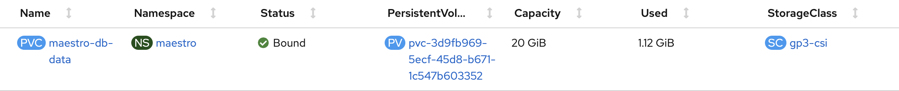
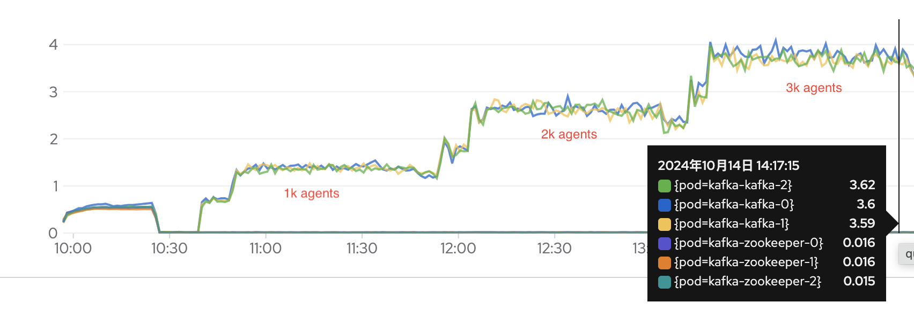
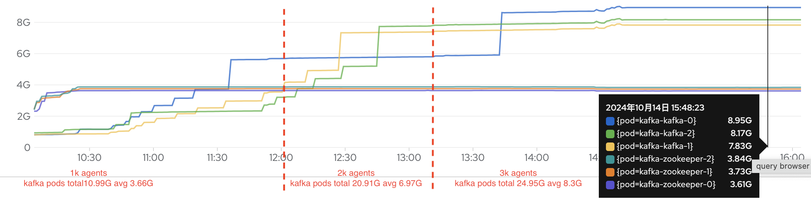
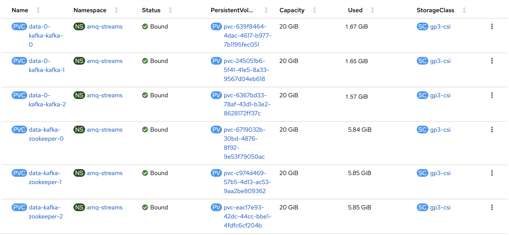

## Workloads

- Total clusters are 3000 clusters.
- Each cluster has 50 manifestworks.
- Each manifestwork contains one [guestbook application](pkg/workloads/manifests/guestbook/) witch has 7 kube resources, and we simulated the actual situation to add the status to manifestwork, one manifestwork size is 11.7K (including spec 4.5K and status 7.2K)
- Total manifestworks are 150,000, total size is 1.6G.
- Total cloudevents are 300,000 (including spec and status cloudevents)

## Test Steps

1. Create 3000 clusters (consumers) in the maestro
2. Start 1000 agents to connect Kafka broker (one agent represents a cluster)
3. Create 50,000 manifestworks at a rate of 10 manifestworks per second.
4. Repeat step 2, 3, 4 until there are 3000 clusters and 150,000 manifestworks.

## Resource consumptions

### Maestro

#### Summary

1. The CPU usage is relatively stable
2. The memory usage grows linearly 

### Kafka

- 3 Kafka brokers
- 3 Zookeepers
- 2 Kafka topics (`sourceevents` and `agentevents`), each topics has 50 partitions
- 6000 Kafka ACLs, one agent has two ACLs to access the topics

#### Summary

1. The CPU usage is relatively stable
2. Total memory is about 36G (one broker is about 8G, one zookeeper is about 4G)

#### Refer
[Running Kafka in Production with Confluent Platform](https://docs.confluent.io/platform/current/kafka/deployment.html)